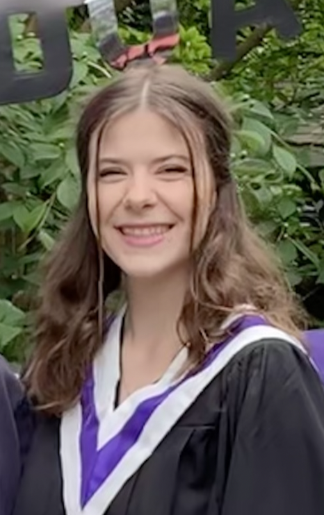

layout: page
title: "PAGE-TITLE"
permalink: /URL-PATH
description: "PAGE-DESCRIPTION"
# ---
# > Add Markdown syntax content to file `_tabs/about.md`{: .filepath } and it will show up on this page.

---
layout: 
title: Cam Bass - Computational Genetic Biologist
---

# 

# Cam Bass  
**Computational Genetic Biologist**  
*Bridging Genomics, Code, and Biotech Innovation*

## Technical Expertise
**Programming:** Python, Java, C/C++, R, UNIX/Linux, Snakemake  
**Bioinformatics:** GWAS, QTL Mapping, SAMtools, BWA, PLINK  
**Databases:** NCBI, Ensembl, GnomAD, OMIM  

## Featured Projects
### [GitHub Genetic Scripts](https://github.com/camrynbass/genetics_project)
- Python/UNIX pipelines for variant calling
- Snakemake workflows for GWAS analysis

### Bioplastic-Producing E. coli
- Engineered GM bacteria at UVic Biotech Club
- 30% yield improvement through Python optimization

## Professional Experience (Expandable)

📚 Education & Certifications

- **University of Victoria**  
  B.Sc. Biology Co-op, Software Development Minor  
  *Expected Graduation: May 2025*

- **Certifications**  
  Lifeguarding (Lifesaving Society BC), WHMIS, First Aid/CPR

🔬 Research Experience

- **UVic Biotech Club**  
  Developed bioplastic-generating E. coli (Python bioreactor optimization)
  
- **Dr. Ehlting's Lab**  
  Fungal pathogen isolation for Swiss needle cast mitigation

